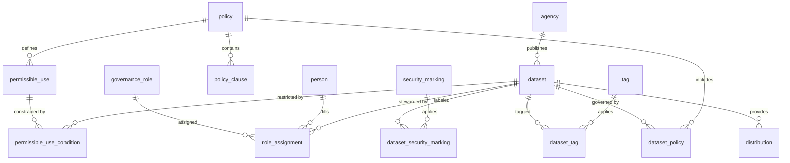

# Data Governance Demo Architecture

## Objectives
- Demonstrate how a government agency can centralize metadata and governance policies in a modern catalog.
- Provide a schema that captures Data.gov dataset metadata alongside agency-specific governance roles and usage restrictions.
- Support future expansion into advanced privacy, cybersecurity, and compliance controls.

## High-Level Components
1. **PostgreSQL Metadata Warehouse**
   - Stores authoritative metadata harvested from Data.gov plus governance overlays.
   - Organizes datasets, distributions, stewardship assignments, permissible uses, and audit trails.
2. **OpenMetadata Catalog**
   - Serves as the end-user interface for discovery, lineage, and policy views.
   - Synchronizes with the PostgreSQL warehouse via an ingestion connector.
3. **Ingestion & Enrichment Pipelines**
   - Periodically pull metadata from Data.gov APIs.
   - Map harvested metadata into normalized tables.
   - Enrich records with governance roles/responsibilities from the Transformation Policy Framework.
4. **Governance Policy Services (Future)**
   - APIs that surface decision logs, approval workflows, and privacy reviews tied to catalog entries.

## Logical Data Model

### Core Tables
- `agency`
  - `agency_id` (PK), `name`, `acronym`, `description`, `contact_email`.
- `dataset`
  - `dataset_id` (PK), `title`, `description`, `source_identifier` (Data.gov `identifier`), `agency_id` (FK), `created_at`, `updated_at`, `landing_page`, `license`, `public_access_level`, `is_sensitive`.
- `distribution`
  - `distribution_id` (PK), `dataset_id` (FK), `title`, `download_url`, `media_type`, `format`, `size_bytes`, `conforms_to`, `checksum`, `temporal_start`, `temporal_end`.
- `tag`
  - `tag_id` (PK), `name`, `description`, `tag_type` (`theme`, `keyword`, etc.).
- `dataset_tag`
  - `dataset_id` (FK), `tag_id` (FK), `tag_source` (`data_gov`, `derived`, `governance`).

### Governance Overlay Tables
- `policy`
  - `policy_id` (PK), `name`, `policy_type` (`privacy`, `cybersecurity`, `sharing`, `retention`), `authority` (law/regulation), `summary`, `effective_date`, `review_cycle_days`.
- `policy_clause`
  - `policy_clause_id` (PK), `policy_id` (FK), `clause_number`, `clause_text`.
- `dataset_policy`
  - `dataset_policy_id` (PK), `dataset_id` (FK), `policy_id` (FK), `applied_by`, `applied_on`, `justification`.
- `permissible_use`
  - `permissible_use_id` (PK), `policy_id` (FK), `use_case`, `description`, `requires_approval`, `approval_authority`.
- `permissible_use_condition`
  - `permissible_use_condition_id` (PK), `permissible_use_id` (FK), `condition_text`, `condition_type` (`role`, `purpose`, `security_marking`, `aggregation_level`).
- `security_marking`
  - `security_marking_id` (PK), `name`, `description`, `classification_level`.
- `dataset_security_marking`
  - `dataset_security_marking_id` (PK), `dataset_id` (FK), `security_marking_id` (FK), `assigned_on`, `assigned_by`, `rationale`.

### Roles & Responsibilities
- `governance_role`
  - `governance_role_id` (PK), `name`, `description`, `responsibilities`, `authority_level`.
- `person`
  - `person_id` (PK), `full_name`, `email`, `organization`, `notes`.
- `role_assignment`
  - `role_assignment_id` (PK), `governance_role_id` (FK), `person_id` (FK), `dataset_id` (nullable FK), `scope` (`enterprise`, `bureau`, `dataset`), `start_date`, `end_date`.

### Audit & Oversight Tables (placeholders)
- `decision_log`
  - `decision_log_id` (PK), `dataset_id` (FK), `decision_type`, `decision_text`, `decided_by`, `decided_on`.
- `data_access_request`
  - `request_id` (PK), `dataset_id` (FK), `requested_by`, `requested_on`, `purpose`, `status`, `decision_log_id` (FK).

## Data Flow
1. **Harvest**: Scheduled job pulls JSON metadata from Data.gov CKAN API and normalizes into staging tables.
2. **Transform**: ETL scripts harmonize field names, deduplicate datasets, and populate the core tables.
3. **Enrich**: Governance policy mapping applies roles, permissible uses, and security markings based on the Transformation Policy Framework.
4. **Publish**: OpenMetadata ingestion pipeline reads from PostgreSQL views and publishes curated metadata to the catalog UI.
5. **Monitor**: Audit tables capture policy decisions, access requests, and lineage events for compliance reporting.

## Integration Touchpoints
- **OpenMetadata Database Connector**: Configure the OpenMetadata `databaseService` to connect to the PostgreSQL instance, exposing curated views (`vw_catalog_dataset`, `vw_permissible_use`, etc.).
- **Lineage & Glossary**: Map governance roles to OpenMetadata Glossary terms for policy awareness; use the taxonomy to surface permissible use categories.
- **Security & Privacy Operations**: Export security markings to downstream systems (e.g., data lake access controls) via API endpoints (future work).

## Next Steps
- Implement SQL DDL files that instantiate the schema defined above.
- Build ingestion scripts that transform Data.gov metadata into the warehouse structure.
- Configure OpenMetadata to read from the PostgreSQL catalog and expose governance fields in the UI.
